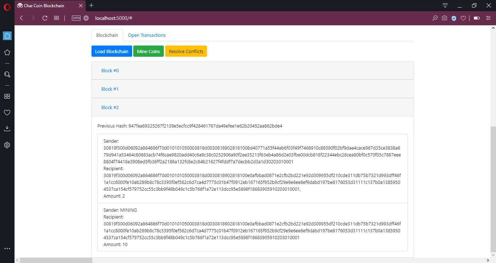

# ☕ Chai_coin 
  

Chai Coin is a peer-to-peer cryptocurrency that enables instant and near-zero cost payments to anyone in the world and that can be efficiently mined with consumer-grade hardware. Chai Coin project is built from scratch and is an open-source, global payment network that is fully decentralized without any central authorities.

### Features

- Decentralized network
- Chai Coin Wallet
- Peer-to-peer transactions
- Mining Rewards
- Fraud Detection
- Conflicts Resolution
- Platform independent

### How to use

1.	Clone the repository in your local machine.

2.	Now open cmd/terminal and run the node.py file with “-p \<custom port number\>” in the argument. The default port is set to 5000. But it is recommended to use a different port number to avoid any issues, especially when you’re running multiple nodes on the same machine.
  
  

3.	Once the flask app is running, open the following link in your browser – http://localhost:\<your port number\> which in my case is http://localhost:5001. For the demo, I’ve started another instance on port 5000 as well. The page will look like -

  

4.	You can either create a new wallet or load your existing wallet to use the network. After creating a new wallet, you’ll see your private key and public key displayed on top. This public key is going to be your wallet address.
  
  

5.	Once your wallet is loaded, you’ll need to add some peer node to connect to the blockchain network. Here I’ll use the second node running on port 5001. Go to the Network tab on top, and add localhost:5001 as a peer. You’ll get a confirmation message and also you can check the list of all peer nodes by clicking on the Load Peer Nodes button.
  
  

6.	Now to earn some coins and also to verify open transactions, you can mine a block by clicking on the Mine coins button. Once a block is mined, you'll notice that a new block is added to the blockchain (click on the Load Blockchain button if it doesn’t reflect new blocks automatically). And the wallet balance is updated to +10 coins which is the mining reward here. You can also check the processed transactions in the blocks by clicking on them.
  
  .jpg)

7.	You can see that the newly mined block is reflected on the other node instance as well.
  
  

8.	To make a transaction, insert the wallet address of the recipient (public key) into the Recipient Key field and the number of coins you want to send, and click on the Send button. You’ll get a transaction confirmation on top.
  
  

9.	This transaction is now added to the open transactions list and is synced with all the peer nodes.
  
  

10.	To verify and complete this transaction, a new block needs to be mined. I’ll mine a new block from the receiver node which is running on port 5000 and has 0 coins available yet. Once the new block is mined, the balance is updated to 12, where 10 coins are for mining, and 2 coins are received from a peer. These transactions are available under the newly mined block and this updated blockchain is synced across all peer nodes.
  
  

11.	These wallets and blockchains of both nodes are stored locally in the repository folder and can be reloaded back anytime in the future.
  
  

12.	Any manual changes in these files in the transactions or in blocks on the local blockchains will break and discard the local blockchain. And the updated blockchain will be automatically downloaded from the network. In case of any conflicts while making any transactions, using the Resolve Conflicts button will help. It’ll sync and update the local blockchain from the biggest blockchain on the network.

### Development

Want to contribute? Great! 🙂
